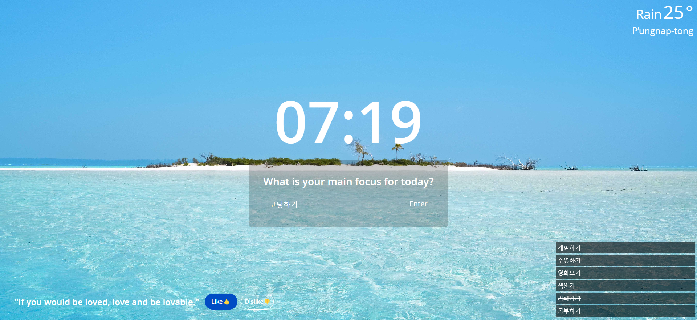
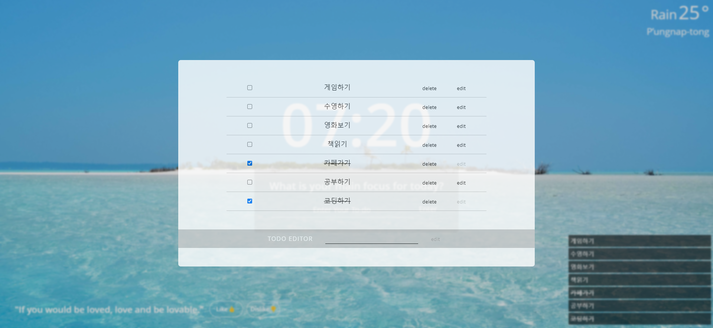

# toyproject - Momentum
  
Momentum을 클론코딩한 항해99 사전 스터디 토이 프로젝트입니다.  
  
## Tech Stack
  
     
 
  
- **FrontEnd** : HTML5 / CSS3 / JavaScript / jQuery  
- **BackEnd** : Python / MongoDB  
- **VCM** : git / GitHub  
      
## Preview
  


  
### 주요 기능
  
- ✅TodoList : Todo Add, Edit, Complete toggle, Delete 기능  
- 💭Quote : 새로고침 시 Quote 무작위로 표시, 좋아요/싫어요(싫어요 -5 이상이면 더이상 보이지 않음)  
- 🌤️Weather : 현재 위치 기준 날씨 정보 표시  
- 🕑Clock : 현재 시간 실시간 반영  
- 🏞️Wallpaper : 새로고침 시 배경화면 사진 무작위로 표시  
  
## 팀원
  
- 배근아 | 팀장  
  - 담당 : TodoList 마크업 및 기능구현, TodoList 메인페이지 디자인, GitHub Repository 관리   
  - 느낀점 : 팀장으로서 pull request 관리나 프로젝트 일정 조율 등 개인 프로젝트와 다른 경험을 할 수 있었습니다. 또한 Python을 처음 사용하여 클라이언트와 서버 간 간단한 HTTP 통신을 경험해 볼 수 있던 점이 의미 있었습니다.  

- 김미리 | 팀원
  - 담당 : background 랜덤 이미지 구현
  - 느낀점 : 새로고침 시 랜덤 이미지가 나오도록 하는 것이 감이 오지 않았으나, 구글링을 통해 여러 방법들을 찾아볼 수 있었습니다. 그로인해 여러 js 함수를 배웠고, 결과적으로는 직접 저장한 이미지 파일을 사용하여 랜덤 이미지를 구현하였는데, 실제로 랜덤 이미지 api를 제작할 수 있는 방법이 있다면 배워보고 싶다는 생각이 들었습니다.

- 김원호 | 팀원
  - 담당 : TodoList 마크업 및 기능구현, TodoList 팝업 디자인, 모바일 500px 이하 버전 화면 구성
  - 느낀점 : 팀 프로젝트를 하면서 지금 까지의 개인 프로젝트를 비교했을 때 장단점을 파악할 수 있었으며 협업을 통해 대화가 얼마나 중요한지 깨달을 수 있었습니다. Python을 사용해 간단하지만 Http 통신을 해볼 수 있는 색다른 경험을 가질 수 있었습니다.

- 두성한 | 팀원
  - 담당 : 
  - 느낀점 : 

- 신필재 | 팀원
  - 담당 : 
  - 느낀점 : 


## 참고사항

### python packages

```text
flask
certifi          
pymongo            
python-dotenv      
requests    
bs4   
dnspython   
```